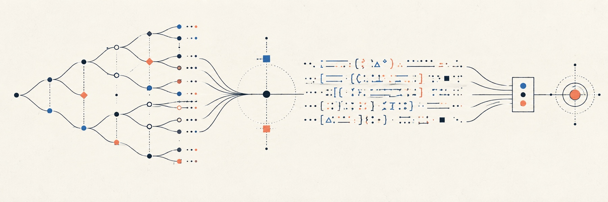

# Slean

Slean is a local Lean 4 prototype for checking the structure and decision history of research dossiers.



## Why Slean

A decision can depend on a frozen protocol, earlier events, observations, costs, and outcomes. Slean brings those records into one versioned journal so their links and history can be inspected at a chosen prefix.

See [product scope](PRODUCT.md) and the [architecture and trust boundary](ARCHITECTURE.md).

## What works today

- A Lean CLI that reads JSON cases using the versioned schema and semantics pairs 0.1.0, 0.2.0, and 0.3.0.
- Structural checks for IDs, references, event order, units, one exact-decimal threshold rule, and recorded protocol cost caps.
- Replay and validated views of journal prefixes, plus audience-filtered exports.
- A typed Lean example and a matching synthetic JSON fixture, with a [local Explorer](explorer/README.md) for inspecting validated prefixes.

The examples are synthetic. Slean checks the dossier's recorded structure; it does not establish that measurements are valid or external assessments are correct. Recorded dependency gates are not evaluated for truth.

## Get started

Install [elan](https://github.com/leanprover/elan#installation); the repository's [`lean-toolchain`](lean-toolchain) pins Lean 4.28.0. Then clone the repository and run the build, checks, and example validator:

```sh
git clone https://github.com/romainsimon/slean.git
cd slean
lake build
bash tests/check.sh
lake exe slean validate examples/valid.json
```

The example validator prints:

```json
{"case_id":"synthetic-decision-1","events":10,"ok":true}
```

## Contributing

There is no separate contribution guide yet. Keep changes focused, add regression coverage when behavior changes, and run `lake build` and `bash tests/check.sh` before opening a pull request. The check script builds the Lean project, runs the Python tests, and checks parity between the typed Lean example and the JSON fixture.

## License

No public license has been selected, and this repository has no `LICENSE` file. The license decision is pending owner review; see the [project roadmap](ROADMAP.md).
